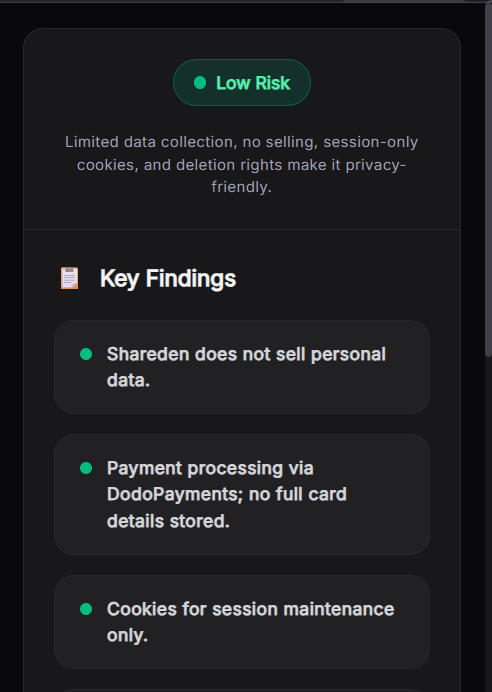
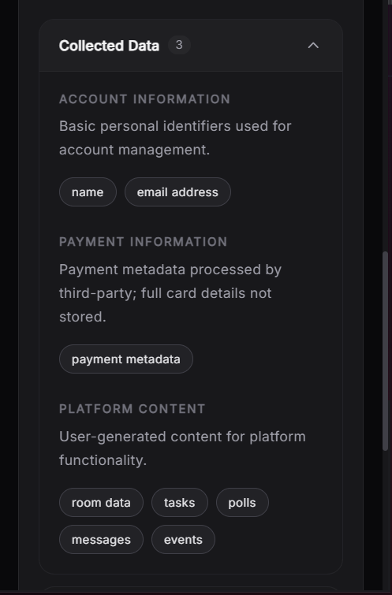
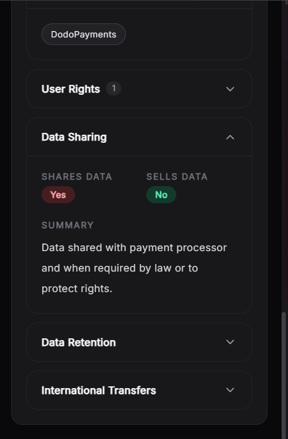
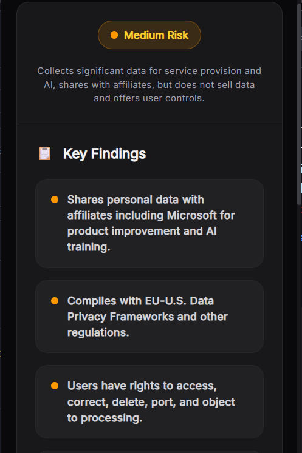
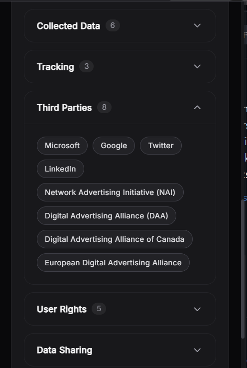
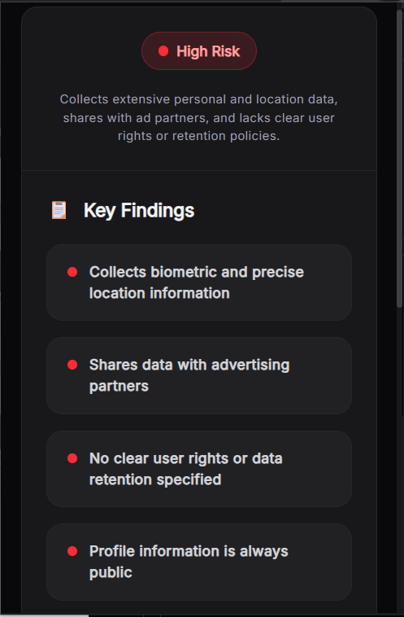
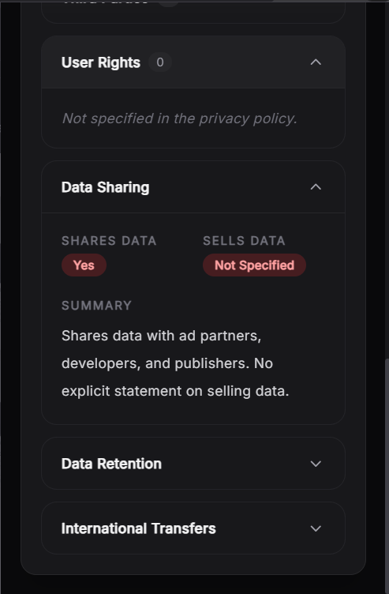

# Anvesha - Privacy Policy Analyzer

AI-powered Chrome extension that helps users understand any website's privacy policy in one click with concise summaries, risk scores, and key privacy insights.

## Demo

### Low Risk
| Overview | Detailed Analysis |
|----------|-------------------|
|  |  |  |

### Medium Risk
| Overview | Detailed Analysis |
|----------|-------------------|
|  |  |

### High Risk
| Overview | Detailed Analysis |
|----------|-------------------|
|  |  |

---

## Features

- 🔍 Automatically locates a website's privacy policy
- 📄 Extracts the main policy content using Mozilla Readability
- 🤖 AI-powered privacy analysis
- ⚠️ Privacy risk assessment (Low / Medium / High)
- 📊 Structured summaries and key findings
- 🔒 Highlights data collection, tracking, third parties, data sharing, retention, international transfers, and user rights
- ⚡ Simple caching to reduce repeated AI requests

---

## How It Works

1. Click **Analyze** on any website.
2. The extension locates the website's privacy policy.
3. The policy is extracted and cleaned.
4. The content is sent to the backend AI pipeline.
5. A structured privacy report is returned to the extension.

---

## Privacy Policy Extraction

Anvesha uses multiple strategies to reliably locate privacy policies across different websites.

### Strategy 1 — Current Page

If the user is already viewing a privacy policy, the extension extracts it directly.

### Strategy 2 — Homepage Discovery

If no privacy policy is found on the current page, the extension:

- navigates to the website's homepage
- searches for links such as **Privacy**, **Privacy Policy**, **Legal**, **Terms**, etc.
- opens the discovered privacy policy
- extracts the main article

### Strategy 3 — SPA Support

For Single Page Applications (React, Next.js, Vue, etc.), the extension waits for client-side rendering before extracting the content.

Content extraction is powered by **Mozilla Readability**, which removes navigation bars, sidebars, advertisements, headers, footers, and other non-essential elements.

---

## AI Pipeline

Anvesha uses a two-stage AI pipeline powered by **DeepSeek V4 Flash**.

### Stage 1 — Information Extraction

The first model extracts factual information from the privacy policy into a structured JSON format, including:

- Collected data
- Tracking technologies
- Third-party services
- Data sharing
- User rights
- Data retention
- International transfers

### Stage 2 — Privacy Assessment

The extracted data is evaluated to generate:

- Privacy risk score
- Executive summary
- Key findings
- User-friendly explanations

Separating extraction from evaluation improves consistency and reduces hallucinations especially for cheaper models.

---

## Caching

To reduce inference costs and improve response times, Anvesha hashes the cleaned privacy policy and caches completed analyses using **better-sqlite3**. If the same policy is analyzed again, the cached result is returned instantly without invoking the AI pipeline.

---

## Tech Stack

### Frontend

- React
- Vite
- Chrome Extension Manifest V3
- Mozilla Readability

### Backend

- Node.js
- Express.js
- better-sqlite3

### AI

- deepseek-v4-flash

---

## Future Improvements

- Faster processing for very large privacy policies